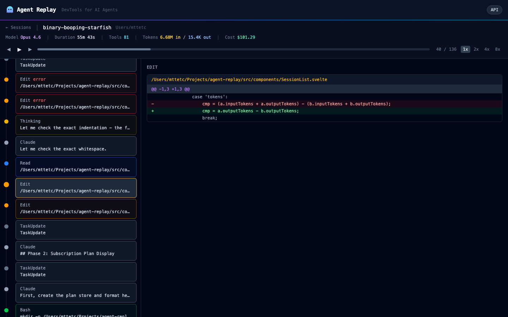

# Agent Replay

Local analytics for AI coding agents. Agent Replay reads the session logs your coding agents already write to disk, replays them event by event, and answers the question no agent can answer about itself: **how much of what it wrote is still in your repository?**



Everything runs on your machine. Nothing is uploaded unless you explicitly ask for an LLM post-mortem, and then only a compact evidence pack goes to the provider you configured.

## What it does

**Replay.** Step through any session with keyboard controls: prompts, thinking, tool calls, syntax-highlighted diffs, command output, token usage per turn.

**Measure code survival.** For every `Edit` and `Write` the agent made, Agent Replay follows the lines it produced into the repository as it is now and classifies each one as committed, uncommitted, or gone. Lines the agent replaced itself during the session are counted separately as self-revised. This is the only outcome metric in the app that is measured rather than estimated, and it is the backbone of the session verdict.

**Audit setup overhead.** Every `CLAUDE.md`, skill and MCP server you load costs tokens on every turn. The overhead audit prices that cost per month, attributes the spend each skill generates when invoked, and flags what you pay for but never use.

**Detect friction deterministically.** Edit loops, edit-fail-retry sequences, files read four times and never changed, repeated identical prompts, idle gaps. All computed from events, no model involved.

**Generate a post-mortem.** Optional. Sends the evidence pack (user messages, tool errors, per-file operation sequences, detected loops, survival results, related commits) to an LLM and gets back a structured analysis: what happened, where time was lost, where a human had to step in, what to change. Every claim must cite event ids; citations to events that do not exist are stripped and counted so you can see how much of the analysis is actually grounded.

**Correlate with git.** Related commits are found by time window and file overlap and shown on the session page.

## Supported agents

Coverage is not equal across agents, because their logs are not equal. This table says what each provider actually yields.

| Agent | Source | Prompts | Tool calls | Edit text | Tokens | Survival |
|---|---|---|---|---|---|---|
| Claude Code | `~/.claude/projects/**/*.jsonl` | yes | yes | yes | yes | yes |
| Cursor | local SQLite (`state.vscdb`) | yes | partial | file path only | partial | no |
| Windsurf | local SQLite | yes | partial | file path only | no | no |
| Aider | `.aider.chat.history.md` | yes | inferred from mentioned files | no | no | no |
| GitHub Copilot Chat | VS Code `globalStorage` JSON | yes | no | no | no | no |

Survival requires the edited text, which only Claude Code records. The cross-agent comparison that is actually rich is Claude Code versus Cursor. The others are coverage, not analysis.

## Quick start

Requires Node 22 or later.

```sh
npx agent-replay
```

Or install globally:

```sh
npm install -g agent-replay
agent-replay          # dashboard
agent-replay last     # open the most recent session directly
agent-replay install-hook   # Claude Code Stop hook that prints a session summary
```

Your browser opens automatically. Use `--no-open` to disable this.

## Post-mortem configuration

The post-mortem is off until you configure a provider. Set one of these before starting the server.

Claude API:

```sh
export ANTHROPIC_API_KEY=sk-ant-...
# optional, defaults to claude-opus-5
export AGENT_REPLAY_LLM_MODEL=claude-sonnet-5
```

Local model through Ollama, nothing leaves the machine:

```sh
export AGENT_REPLAY_LLM_PROVIDER=ollama
export AGENT_REPLAY_LLM_MODEL=qwen3        # any model with JSON-schema output support
export OLLAMA_BASE_URL=http://localhost:11434   # default
```

A post-mortem is generated only when you click the button on a session page. The panel tells you which model it will call and where. Results are stored in `~/.agent-replay/data.db` and can be regenerated at any time.

## How survival is computed

1. Take every successful `Edit` (`old_string` → `new_string`) and `Write` (`content`) in the session, in order.
2. Normalize lines (trim, collapse whitespace) and drop lines under 6 characters or without a letter or digit, so `}` and `);` do not count as authorship.
3. Replay the edits per file to get the agent's net contribution at the end of the session. A line added and later removed by the agent itself is self-revised, not human rework.
4. Compare the net lines against `git show HEAD:<file>` and the working tree. Present in HEAD is committed, present only in the working tree is uncommitted, absent from both is gone.
5. Aggregate per file and per session. The dashboard aggregates the forty most recent Claude Code sessions in the selected range.

Limitations, stated plainly: the metric is line-based, so a line the human reformatted beyond whitespace counts as gone. Files edited outside the session's repository are skipped. Very short edits produce too few significant lines to measure and are reported as such.

## Development

```sh
git clone https://github.com/mttetc/AgentReplay.git
cd AgentReplay
npm install
npm run dev          # http://localhost:5173
npm test             # vitest
npm run check        # svelte-check
```

Key modules under `src/lib/server/`:

| Module | Role |
|---|---|
| `providers/*` | One parser per agent, all producing the same `SessionTimeline` |
| `parser.ts` | Claude Code JSONL → timeline, with turn reassembly and per-event token attribution |
| `code-survival.ts` | Survival measurement against git, session and cross-session |
| `overhead-analysis.ts` | CLAUDE.md / skills / MCP token cost and attribution |
| `codebase-analysis.ts` | Deterministic pattern detection, per-file and per-project rollups |
| `postmortem.ts` | Evidence pack, output schema, citation validation, LLM providers |
| `git-integration.ts` | Commit correlation by time window and file overlap |
| `db.ts` | SQLite persistence (annotations, tags, bookmarks, caches, post-mortems) |

## Tech stack

SvelteKit 2, Svelte 5, Tailwind CSS 4, Vite 7, TypeScript, better-sqlite3, Chart.js, Anthropic TypeScript SDK.

## Environment variables

| Variable | Default | Description |
|---|---|---|
| `PORT` | `3000` | Server port |
| `CLAUDE_DIR` | `~/.claude/projects` | Claude Code session directory |
| `ANTHROPIC_API_KEY` | unset | Enables post-mortems through the Claude API |
| `AGENT_REPLAY_LLM_PROVIDER` | auto | `anthropic` or `ollama` |
| `AGENT_REPLAY_LLM_MODEL` | `claude-opus-5` / `qwen3` | Model used for post-mortems |
| `OLLAMA_BASE_URL` | `http://localhost:11434` | Ollama endpoint |

## License

MIT
